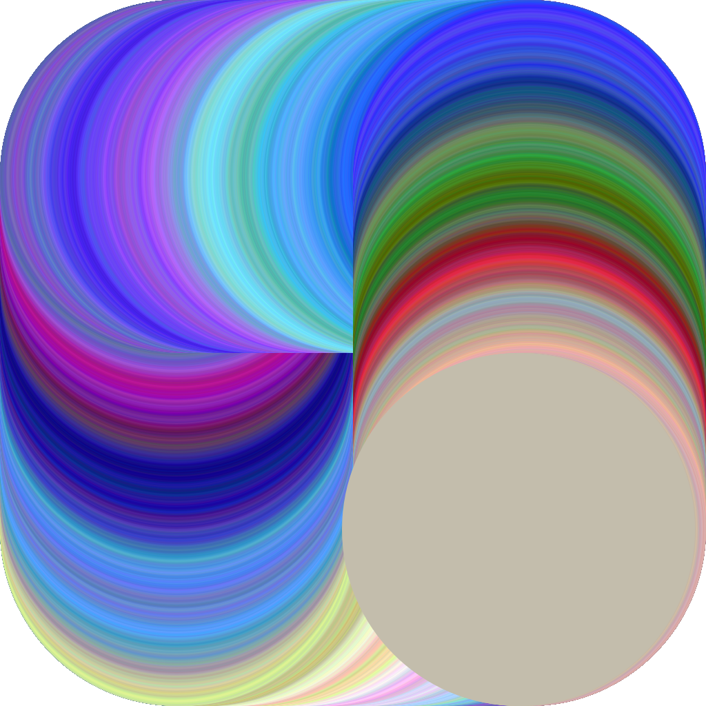
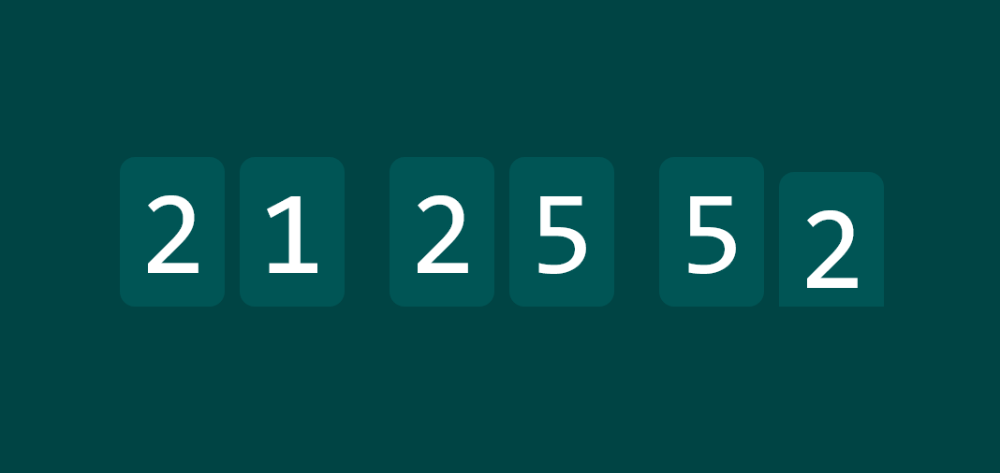

<h1 align="center">HTML5 fun</h1>

<i>by <a href="https://leox.dev/">Leonard Lesinski</a> :)</i>

---

## Clocks

### [CLK-000](https://html5fun.leox.dev/clocks/000)

A simple clock, powered by almost no JS and a bit of CSS. It's not a stupid clock which scrolls from 9 all the way back to 0, showing all the other numbers; instead, it creates the effect that it's scrolling forever.

#### Customization parameters

- `bg`: background color of the page in hexadecimal format (default: #111)
- `fg`: text color of the digits (default: #aaa)
- `border`: border color of the digits (default: #555)
- `digit`: digit background color (default: #0000)

## Canvas related stuff

### [CNV-000](https://html5fun.leox.dev/canvas/000)

Just a canvas drawing a randomized gradient. In a loop. Forever.

#### Customization parameters

- `size`: size of the circle (default: 20)
- `speed`: speed of the circle (default: 1.0)
- `x`: initial x position (default: size)
- `y`: initial y position (default: size)
- `vx`: initial x velocity (default: speed)
- `vy`: initial y velocity (default: 0.0)
- `r`: initial red color value (default: 100.0)
- `g`: initial green color value (default: 200.0)
- `b`: initial blue color value (default: 200.0)
- `colorChangeSpeed`: speed of color change (default: 1.0)
- `minColorValue`: minimum value of the sum of the color values (default: 512.0)
- `maxColorValue`: maximum value of the sum of the color values (default: 768.0)
- `cooldown`: time between each frame (default: 0)
